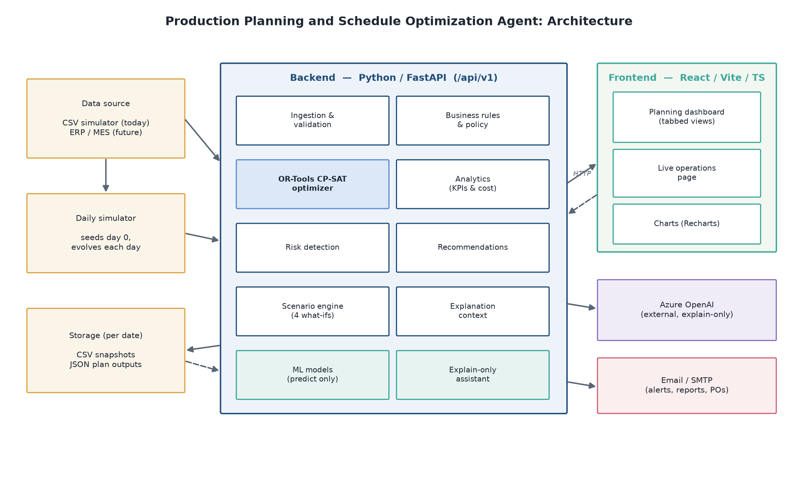
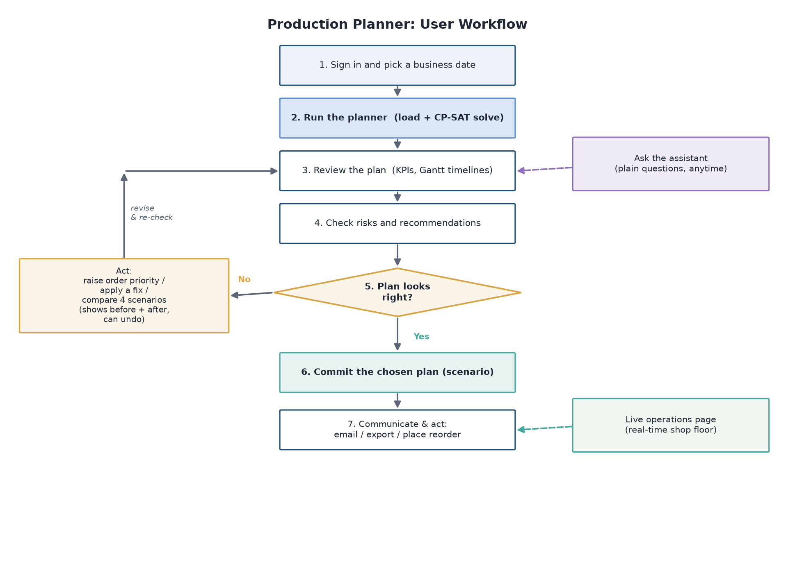

# Production Planning and Schedule Optimization Agent

## Approach Document

---

## 1. Purpose of this document

This document explains how the product is built and why. It covers the overall design, the pipeline
that turns raw factory data into a committed plan, the technology choices, and the reasoning behind the
key decisions. It stays at a level that a planner, a manager, or a new engineer can follow.

---

## 2. Guiding principles

The whole system is shaped by a few rules that were set early and held throughout.

1. **Scheduling must be deterministic.** The plan comes from a mathematical constraint solver. The
   same inputs always produce the same plan. Nobody should have to wonder why today's plan is different
   from yesterday's for no reason.
2. **The language model never decides anything.** It only explains results and answers questions. All
   real decisions come from the solver and from fixed business rules.
3. **Analysis is read only.** The parts that detect risks, build recommendations, run scenarios, and
   compute KPIs never change the schedule. Only the planning step and explicit planner actions change
   it.
4. **Everything is explainable.** Every plan change is logged with before and after numbers, and the
   assistant can explain any part of the plan from the real data.
5. **The data source is replaceable.** The factory data comes from a simulator today, but it sits
   behind a clean boundary so a live ERP or MES feed can replace it later without touching the
   planning logic.

---

## 3. High level architecture

The system has three parts.

- **Backend.** Python with FastAPI. Holds the optimizer, the business rules, the analytics, the risk
  and recommendation engines, the scenario engine, the assistant, and the daily simulator. All
  endpoints live under `/api/v1`.
- **Frontend.** React with TypeScript, built with Vite. A dashboard for planning and a separate live
  operations page. Charts use Recharts.
- **Data.** Daily factory snapshots stored as CSV files per date. Planning outputs are stored per date
  as well, so a plan can be reloaded exactly as it was.

The diagram below shows how these parts fit together, from the data source on the left through the
backend engines to the two frontend surfaces on the right.



The processing order inside the backend, written as a simple flow, is:

```
Data source (CSV simulator today, ERP or MES later)
  -> Ingestion and validation
  -> Business rules and policy
  -> OR-Tools CP-SAT optimization
  -> Analytics (KPIs and cost)
  -> Risk detection
  -> Recommendations
  -> Scenario planning (four what ifs)
  -> Explanation context
  -> Persisted results
```

---

## 4. User workflow

The diagram below shows the path a production planner takes through the app on a normal day, from
signing in to committing a plan and communicating it. The steps in the middle can be repeated as often
as needed before the planner commits.



In words, the day usually runs like this.

1. **Sign in and pick a date.** The planner opens the dashboard and selects the business date to plan.
2. **Run the planner.** One click loads the factory state and solves the schedule.
3. **Review the plan.** The planner reads the KPIs and the machine and order timelines.
4. **Check risks.** The planner reads the graded risks and the matching recommendations.
5. **Act if needed.** The planner raises order priorities, applies a fix, or compares the four
   scenarios. Every change shows before and after numbers and can be undone. This loop repeats until
   the plan looks right.
6. **Commit a plan.** The planner commits the chosen scenario as the working plan.
7. **Communicate and act.** The planner emails the plan or a risk alert, exports it, or places a
   material reorder.
8. **Ask the assistant.** At any point the planner can ask the explain only assistant a plain question
   about the plan.
9. **Watch live operations.** A separate page shows the real time shop floor status as the day runs.

---

## 5. The planning pipeline step by step

When a planner runs the plan for a date, the following happens in order.

1. **Load data.** The factory state for the date is read: open orders, machines, workers, materials,
   routings, shifts, and maintenance windows.
2. **Validate.** The data is checked for integrity before anything is scheduled, so a bad input fails
   early and clearly rather than producing a silent wrong plan.
3. **Apply rules.** Business rules and policy shape the problem, for example how strictly due dates are
   enforced.
4. **Optimize.** The constraint solver builds the actual schedule: which operation runs on which
   machine, with which worker, at what time.
5. **Compute analytics.** KPIs and costs are derived from the schedule: on time delivery, machine
   utilization, tardiness, work in progress, and a full cost breakdown.
6. **Detect risks.** A fixed set of detectors scans the plan and grades each problem by severity.
7. **Build recommendations.** Each risk is mapped to a concrete, feasibility checked action.
8. **Run scenarios.** Four ways to run the day are solved and compared against the baseline.
9. **Build explanation context.** A curated set of facts is prepared so the assistant can answer
   questions without ever touching the solver.
10. **Persist.** Everything is saved per date so it can be reloaded and reused without recomputing.

---

## 6. The optimization core

This is the heart of the product.

- **Engine.** Google OR-Tools CP-SAT, a constraint programming solver. It is chosen because it is
  free, proven, and strong at exactly this kind of scheduling problem.
- **What it decides.** The start time and resource assignment for every operation across all orders.
- **Objective.** The solver minimizes a weighted combination of goals, with keeping orders on time as
  the dominant goal, followed by reducing total lateness, makespan, and cost. On time delivery is
  strengthened by an explicit penalty for each late order, weighted by order priority, so the solver
  maximizes the count of orders that ship on time rather than only shaving minutes off lateness.
- **Constraints.** These are the real world rules the plan must respect:
  - A machine can only run one operation at a time.
  - Each operation needs exactly one qualified worker, and a worker cannot be in two places at once.
  - An order cannot start until its materials are available.
  - Machines are blocked during maintenance windows.
  - Operations within an order run in the correct sequence.
  - Shift operating windows are respected.
- **Time budget.** The solver runs under a wall clock limit (sixty seconds by default) with eight
  parallel search workers. This gives good quality plans in a predictable time.

A note on reproducibility. Running with a single worker would make the solver bit for bit
reproducible, but it collapses the scenarios so they all look the same, and it lowers plan quality.
Running with eight workers gives high quality, clearly different scenarios but is not bit for bit
identical between runs. The chosen design keeps eight workers for quality and gets stability a
different way, described next.

---

## 7. Scenario planning and the compute once approach

The tool prepares four scenarios for each day:

- **Current plan.** The baseline.
- **Overtime.** Extra labor capacity added.
- **Alternate machines.** Backup machines brought in and down machines repaired.
- **Additional shift.** Night shift machines and a night crew added.

Each scenario has its own weighted objective, and each one warm starts from the baseline schedule.
Warm starting guarantees a capacity scenario is never worse than the baseline, because it only adds
resources on top of a plan that already works.

The important design decision here is **compute once, reuse on select**. All four scenarios are solved
once when the plan runs, and each full schedule is saved to disk. When a planner selects a scenario to
commit, the tool reuses the saved schedule instead of solving again. This means the committed plan
exactly matches what the planner previewed, with no drift. It also makes the interface feel fast, since
selecting a plan is just a load rather than a fresh solve. Stability comes from this caching, not from
forcing the solver to be reproducible.

---

## 8. Risk detection and recommendations

Risk detection runs a fixed, ordered set of detectors so the output is predictable:

- Delayed orders against their due date.
- Machine overload beyond capacity.
- Capacity shortage in workforce or machines.
- Material shortage.
- Stock below safety level.
- Worker over allocation.
- Maintenance conflicts.

Each risk gets a severity grade. The recommendation engine then maps risks to corrective actions,
removes duplicates, checks each action is feasible, and orders them by priority. Both engines are read
only. A planner acts on a recommendation explicitly, for example by raising the priority of at risk
orders, and the tool re-plans and records the before and after numbers so the change can be reviewed or
undone.

---

## 9. The machine learning models

The product uses machine learning, but only for prediction and insight, never for scheduling. The
models are trained on historical data and loaded at runtime. They predict:

- Delay risk for a pending operation.
- Machine downtime risk from sensor readings.
- Failure type for a machine.
- Operation duration and a high percentile (worst case) duration.
- Demand forecast per product over a horizon, with quantile bands.
- Material stockout risk and sensor anomalies.

These signals feed the risk views and the insight charts. Keeping them out of the scheduling decision
is deliberate, because the scheduling must stay deterministic and explainable.

---

## 10. The explain only assistant

The assistant answers planner questions in plain language. It works as follows:

1. **Intent detection** uses simple keyword matching, not a language model, to route a question to the
   right analysis (capacity, bottleneck, delay risk, reorder, and so on).
2. **Grounding** pulls the relevant real facts from the persisted plan and analytics.
3. **Narration** optionally uses Azure OpenAI to phrase the answer nicely on top of the grounded facts.

If Azure OpenAI is not configured, the system still produces a clear, deterministic answer on its own.
The model only improves the wording. It never invokes the solver or changes the plan. This keeps the
assistant safe and trustworthy.

---

## 11. The daily simulator

Since the product is not yet wired to a live plant, a simulator produces realistic factory snapshots.

- **Day zero** is seeded with machines, workers, products, materials, routings, bills of materials,
  orders, customers, and suppliers.
- **Each following day** evolves from the previous day: orders are released, machines fail and recover,
  materials arrive, workers become unavailable, and demand shifts.
- Each day's snapshot is immutable once written, so history is preserved and any past day can be
  replanned exactly.

The simulator has tunable knobs (number of orders, order lead times, number of workers, event
intensity) that were balanced so the plant is loaded enough for scenarios to differ meaningfully while
still achieving high on time delivery. This balance took real tuning, because loose due dates make
scenarios look identical and tight due dates gridlock the day.

---

## 12. Automation and cadence

A background scheduler keeps plans current without a planner having to trigger every run. It refreshes
today's plan and, on the weekly refresh day, publishes the plans for the next week. It is idempotent,
so a day that is already planned is never recomputed, and it is disabled during tests. It runs in a
background thread so solving never blocks the interface or the API.

---

## 13. Frontend design

The frontend is organized around two pages.

- **Dashboard.** The main planning surface, with tabbed views for overview, weekly plan, daily
  progress, machine and order Gantt charts, orders, drift, materials, risks, scenarios, and the current
  plan. It talks to the backend through a single typed API client.
- **Live operations.** A separate page showing the real time shop floor board.

A few interface choices worth noting:

- During any solve (run, apply scenario, mitigate, generate next day) the dashboard shows a full
  content skeleton, because the single worker server is intentionally busy during a heavy solve.
- The committed scenario is authoritative on the backend and stored in the plan data, so it survives a
  reload or a restart rather than living only in the browser.
- The assistant sits in a side dock with clickable suggested questions and can be seeded from the
  charts.

---

## 14. Technology summary

| Layer | Technology |
|-------|-----------|
| Backend framework | Python, FastAPI |
| Optimizer | Google OR-Tools CP-SAT |
| Data models | Pydantic |
| Machine learning | scikit learn style models loaded via joblib |
| Assistant | Azure OpenAI, explain only |
| Frontend framework | React 18, TypeScript |
| Build tool | Vite |
| Charts | Recharts |
| Data storage | CSV snapshots and JSON outputs per date |

---

## 15. Known limitations and next steps

- **Data source.** The simulator should eventually be replaced by a live ERP or MES feed. The clean
  boundary is already in place for this.
- **Authentication.** Sign in is a light client side gate today. A real deployment needs proper server
  side access control.
- **Solver noise.** With eight search workers, minor metrics such as makespan can jitter slightly
  between runs. The primary metric, tardiness, stays reliable, and the compute once caching hides this
  from the planner in day to day use.
- **Email and orders.** These run in a simulated or local mode unless real mail settings are supplied.
